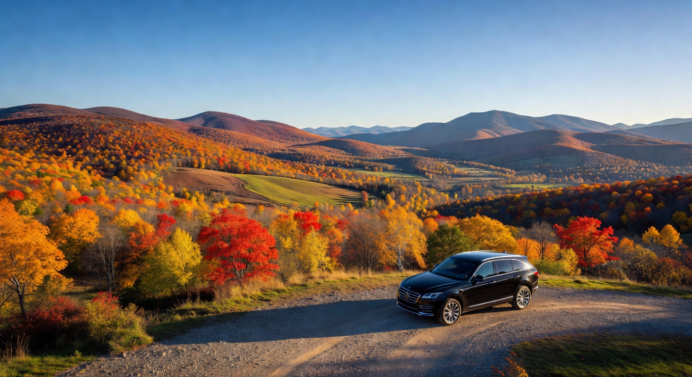

# Berkshire Trips

**Premium livery & chauffeur service in the Berkshires.**

A beautiful, fully static single-page website for Berkshire Trips Livery Service, a local company based in Adams, Massachusetts serving all of Berkshire County.



## Live Site

🌐 **https://rquintos17-rgb.github.io/berkshire-trips**

## Features

- Elegant, mobile-first design with forest green and gold accents
- **Interactive fare calculator**: $10 base + $1 per mile (with presets for common routes)
- Fully functional reservation system that opens a pre-filled email to `queensarahhh413@gmail.com`
- 6 high-quality custom images of Berkshire County generated with Grok Imagine
- Responsive gallery with lightbox
- Service descriptions, fleet details, testimonials, and service area coverage
- Smooth scrolling, booking modal, and mobile navigation

## Tech Stack

- Pure HTML + Tailwind CSS (via CDN) + vanilla JavaScript
- No build step required
- Hosted free on GitHub Pages

## Local Development

1. Clone the repo
2. Open `index.html` directly in a browser, **or** serve it:

```bash
# Python
python -m http.server 8080

# Node (http-server)
npx http-server -p 8080
```

Then visit http://localhost:8080

## Pricing

- **Base fare**: $10
- **Per mile**: $1
- One-way travel. Round trips receive a 15% discount.
- Tolls and parking billed at cost when applicable.

## Contact

**Reservations:** [queensarahhh413@gmail.com](mailto:queensarahhh413@gmail.com)

**Office:** Adams, MA 01220

**Phone:** (413) 555-0198

## License

This project is for the Berkshire Trips livery service. Images generated specifically for this site.

---

Built with care for the beautiful Berkshires. 🍂
